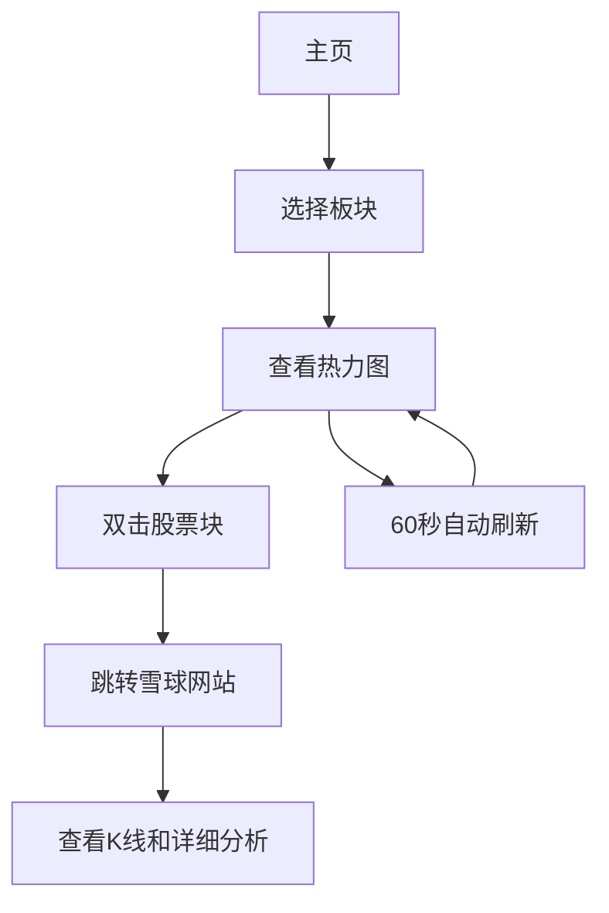

# A股大盘板块走势可视化应用产品需求文档

## 1. 产品概述

本产品是一个A股大盘板块走势可视化web应用，通过热力图的形式展示各个板块内股票的实时走势情况。
- 主要解决投资者快速了解A股市场整体走势和各板块表现的需求，帮助用户直观地识别市场热点和投资机会。
- 目标用户为股票投资者、分析师和金融从业人员，提供专业的市场数据可视化工具。

## 2. 核心功能

### 2.1 用户角色

| 角色 | 注册方式 | 核心权限 |
|------|----------|----------|
| 普通用户 | 无需注册，直接访问 | 可查看所有板块数据、股票热力图、K线图 |

### 2.2 功能模块

我们的A股大盘板块走势应用包含以下主要页面：
1. **主页**：板块导航、股票热力图展示、实时数据更新、外部链接跳转

### 2.3 页面详情

| 页面名称 | 模块名称 | 功能描述 |
|----------|----------|----------|
| 主页 | 板块导航 | 显示所有A股板块分类，支持板块切换和筛选 |
| 主页 | 股票热力图 | 以矩形块展示板块内所有股票，面积代表流通市值，颜色代表涨跌幅 |
| 主页 | 颜色编码系统 | 涨幅用红色表示，跌幅用绿色表示，平盘用灰色，按1%幅度分阶显示 |
| 主页 | 实时数据更新 | 每60秒自动刷新股票数据，保持数据实时性 |
| 主页 | 交互操作 | 支持鼠标滚动拖动浏览，双击股票块跳转到雪球网站查看详情 |
| 主页 | 信息提示 | 鼠标悬停显示股票名称、代码、涨跌幅、市值等详细信息 |
| 主页 | 外部链接 | 双击股票块自动跳转到雪球网站对应股票页面，查看K线和详细分析 |

## 3. 核心流程

用户访问应用后，首先进入主页查看整体市场热力图。用户可以通过板块导航切换不同板块，观察各板块内股票的表现。通过颜色深浅快速识别涨跌幅较大的股票，通过矩形大小了解股票市值规模。当用户对某只股票感兴趣时，双击该股票的矩形块即可跳转到雪球网站查看该股票的详细K线图和技术分析。系统每60秒自动更新一次数据，确保用户看到的是最新的市场信息。

## 4. 用户界面设计

### 4.1 设计风格

- 主色调：深色背景（#1a1a1a），营造专业金融应用氛围
- 辅助色：红色系（#ff4d4f, #ff7875, #ffa39e）表示上涨，绿色系（#52c41a, #73d13d, #95de64）表示下跌，灰色（#8c8c8c）表示平盘
- 按钮样式：圆角矩形，悬停效果
- 字体：微软雅黑 14px，数据标签 12px
- 布局风格：卡片式布局，顶部导航栏
- 图标风格：线性图标，简洁现代

### 4.2 页面设计概览

| 页面名称 | 模块名称 | UI元素 |
|----------|----------|--------|
| 主页 | 板块导航 | 水平标签页，深色背景，白色文字，选中状态橙色高亮 |
| 主页 | 股票热力图 | 矩形网格布局，动态大小，渐变色彩，悬停阴影效果，双击跳转效果 |
| 主页 | 颜色图例 | 右上角位置，显示涨跌幅对应的颜色阶梯 |
| 主页 | 信息面板 | 悬浮卡片，半透明背景，显示股票详细信息 |
| 主页 | 外部链接提示 | 双击时显示跳转提示，确保用户了解将跳转到雪球网站 |

### 4.3 响应式设计

产品采用桌面优先设计，针对大屏幕显示器优化，支持移动端自适应。在移动设备上，热力图将调整为单列滚动布局，保持良好的触控交互体验。