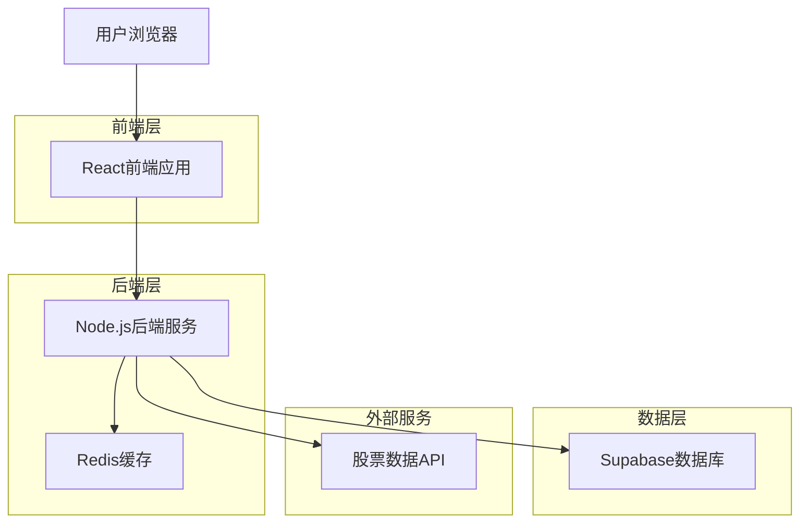
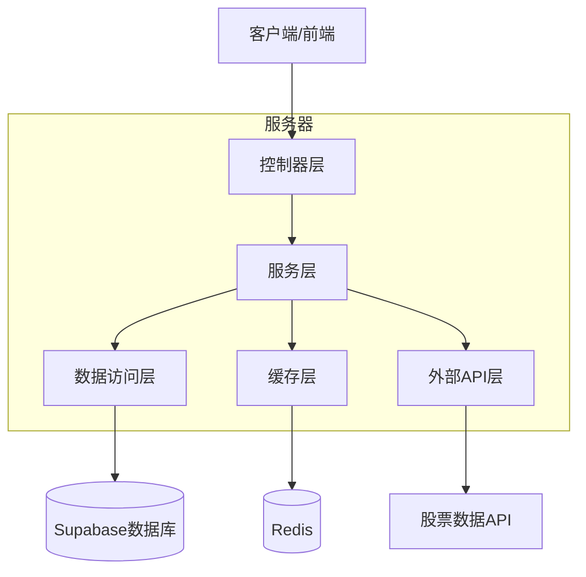
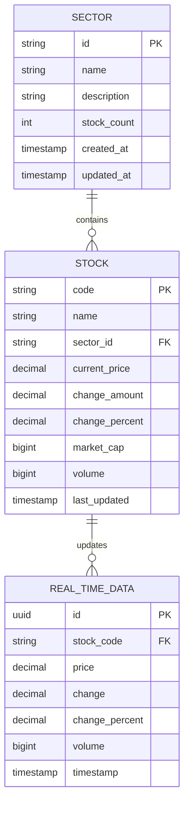

# A股大盘板块走势可视化应用技术架构文档

## 1. 架构设计



## 2. 技术描述

* 前端：React\@18 + TypeScript + Tailwind CSS + D3.js (treemap布局) + Vite

* 后端：Node.js + Express\@4 + TypeScript

* 数据库：Supabase (PostgreSQL)

* 缓存：Redis

* 外部API：股票数据接口（如新浪财经API、腾讯财经API）

### 2.1 矩形树图布局实现

**核心算法**：使用D3.js的treemap布局算法实现板块和股票的矩形分割

**布局原理**：
- 每个板块作为一个大矩形容器
- 板块内的股票按流通市值大小排列成小矩形
- 使用递归分割算法将矩形空间按比例分配给各股票
- 保证所有股票矩形完全填满板块矩形，无空隙

**数据结构**：
```typescript
interface TreemapNode {
  id: string;
  name: string;
  value: number; // 流通市值
  changePercent: number; // 涨跌幅
  children?: TreemapNode[]; // 板块包含的股票
}

interface SectorTreemap {
  id: string;
  name: string;
  value: number; // 板块总市值
  children: StockTreemap[];
}

interface StockTreemap {
  code: string;
  name: string;
  value: number; // 流通市值
  changePercent: number;
  price: number;
}
```

**布局算法配置**：
- 使用D3.treemap()的squarify算法，优化矩形长宽比
- 设置padding分隔板块和股票边界
- 支持动态resize和重新布局

## 3. 路由定义

| 路由                    | 用途              |
| --------------------- | --------------- |
| /                     | 主页，显示股票热力图和板块导航 |
| /sector/:sectorId     | 特定板块的股票热力图      |
| /api/sectors          | 获取所有板块数据        |
| /api/stocks/:sectorId | 获取指定板块的股票数据     |

## 4. API定义

### 4.1 核心API

获取板块列表

```
GET /api/sectors
```

Response:

| 参数名称    | 参数类型          | 描述   |
| ------- | ------------- | ---- |
| sectors | Array<Sector> | 板块列表 |

示例：

```json
{
  "sectors": [
    {
      "id": "banking",
      "name": "银行",
      "stockCount": 42
    }
  ]
}
```

获取板块股票数据

```
GET /api/stocks/:sectorId
```

Request:

| 参数名称     | 参数类型   | 是否必需 | 描述   |
| -------- | ------ | ---- | ---- |
| sectorId | string | true | 板块ID |

Response:

| 参数名称   | 参数类型         | 描述     |
| ------ | ------------ | ------ |
| stocks | Array<Stock> | 股票数据列表 |

示例：

```json
{
  "stocks": [
    {
      "code": "000001",
      "name": "平安银行",
      "price": 12.50,
      "change": 0.25,
      "changePercent": 2.04,
      "marketCap": 242500000000,
      "volume": 15420000
    }
  ]
}
```

获取雪球股票链接

```
GET /api/xueqiu-link/:stockCode
```

Request:

| 参数名称      | 参数类型   | 是否必需 | 描述   |
| --------- | ------ | ---- | ---- |
| stockCode | string | true | 股票代码 |

Response:

| 参数名称 | 参数类型   | 描述       |
| ---- | ------ | -------- |
| url  | string | 雪球股票页面链接 |

示例：

```json
{
  "url": "https://xueqiu.com/S/SZ000001"
}
```

## 5. 服务器架构图



## 6. 前端布局算法

### 6.1 矩形树图实现方案

**布局流程**：
1. 数据预处理：将板块和股票数据转换为层次化结构
2. 计算布局：使用D3.treemap计算每个矩形的位置和大小
3. 渲染矩形：根据布局结果渲染SVG或Canvas矩形
4. 交互处理：添加鼠标悬停、点击、缩放等交互

**关键技术点**：
```typescript
// D3.js treemap布局配置
const treemap = d3.treemap()
  .size([width, height])
  .paddingOuter(2) // 板块间距
  .paddingInner(1) // 股票间距
  .round(true);

// 层次化数据处理
const root = d3.hierarchy(data)
  .sum(d => d.value) // 按流通市值计算面积
  .sort((a, b) => b.value - a.value); // 按市值排序

// 计算布局
treemap(root);

// 颜色映射函数
const colorScale = d3.scaleLinear()
  .domain([-5, 0, 5]) // 涨跌幅范围
  .range(['#52c41a', '#8c8c8c', '#ff4d4f']); // 绿-灰-红
```

**响应式设计**：
- 监听窗口resize事件，动态重新计算布局
- 移动端优化：调整padding和最小矩形尺寸
- 支持板块展开/收缩的动画效果

## 7. 数据模型

### 6.1 数据模型定义



### 6.2 数据定义语言

板块表 (sectors)

```sql
-- 创建板块表
CREATE TABLE sectors (
    id VARCHAR(50) PRIMARY KEY,
    name VARCHAR(100) NOT NULL,
    description TEXT,
    stock_count INTEGER DEFAULT 0,
    created_at TIMESTAMP WITH TIME ZONE DEFAULT NOW(),
    updated_at TIMESTAMP WITH TIME ZONE DEFAULT NOW()
);

-- 创建索引
CREATE INDEX idx_sectors_name ON sectors(name);

-- 初始化数据
INSERT INTO sectors (id, name, description) VALUES
('banking', '银行', '银行业相关股票'),
('technology', '科技', '科技类股票'),
('healthcare', '医疗', '医疗健康类股票'),
('energy', '能源', '能源类股票'),
('finance', '金融', '金融服务类股票');
```

股票表 (stocks)

```sql
-- 创建股票表
CREATE TABLE stocks (
    code VARCHAR(10) PRIMARY KEY,
    name VARCHAR(100) NOT NULL,
    sector_id VARCHAR(50) REFERENCES sectors(id),
    current_price DECIMAL(10,2),
    change_amount DECIMAL(10,2),
    change_percent DECIMAL(5,2),
    market_cap BIGINT,
    volume BIGINT,
    last_updated TIMESTAMP WITH TIME ZONE DEFAULT NOW()
);

-- 创建索引
CREATE INDEX idx_stocks_sector_id ON stocks(sector_id);
CREATE INDEX idx_stocks_market_cap ON stocks(market_cap DESC);
CREATE INDEX idx_stocks_change_percent ON stocks(change_percent DESC);

-- 权限设置
GRANT SELECT ON stocks TO anon;
GRANT ALL PRIVILEGES ON stocks TO authenticated;
```


实时数据表 (real\_time\_data)

```sql
-- 创建实时数据表
CREATE TABLE real_time_data (
    id UUID PRIMARY KEY DEFAULT gen_random_uuid(),
    stock_code VARCHAR(10) REFERENCES stocks(code),
    price DECIMAL(10,2) NOT NULL,
    change_amount DECIMAL(10,2),
    change_percent DECIMAL(5,2),
    volume BIGINT,
    timestamp TIMESTAMP WITH TIME ZONE DEFAULT NOW()
);

-- 创建索引
CREATE INDEX idx_realtime_stock_code ON real_time_data(stock_code);
CREATE INDEX idx_realtime_timestamp ON real_time_data(timestamp DESC);

-- 权限设置
GRANT SELECT ON real_time_data TO anon;
GRANT ALL PRIVILEGES ON real_time_data TO authenticated;
```

